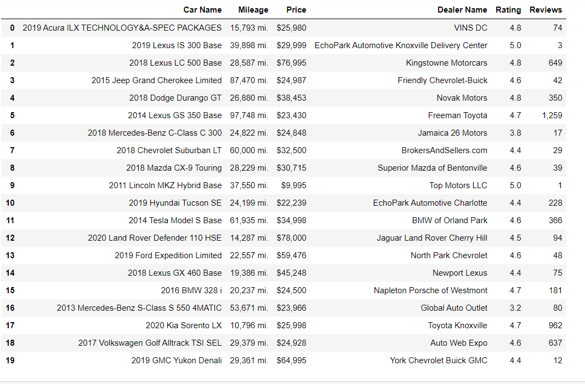
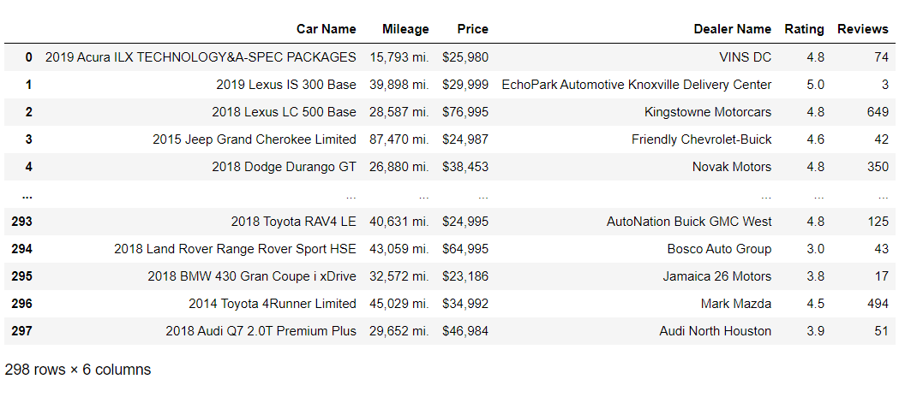

# WebScrapingCarInfo

- I tried to scrape the name, mileage, price, car dealer name, rating and reviews of the vehicles using the BeautifulSoup, Requests and Pandas libraries on the www.cars.com website on Python Jupyter Notebook. 
- During the project, I used multiple pagination while pulling data from the site.

<h2>Main stages of the project</h2> 

1-Importing Python Libraries 
2-Assigning the website link to the variable and http request control 
3-Creating the soup object and passing the results to the results variable 
4-Getting the name, mileage, price, car dealer name, rating and reviews we need from the website and assigning them to the variables 
5-While performing these operations, creating empty arrays and enclosing them in a for loop 
6-Creating a Pandas dataframe 
7-Data cleaning operation on dataframe 
8-Performing multiple paging operations 
9-Export data to excel 

   

